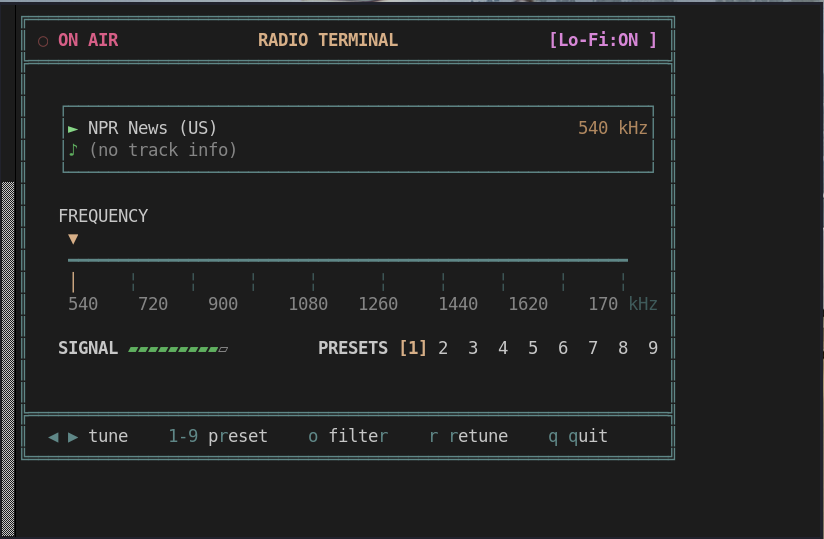
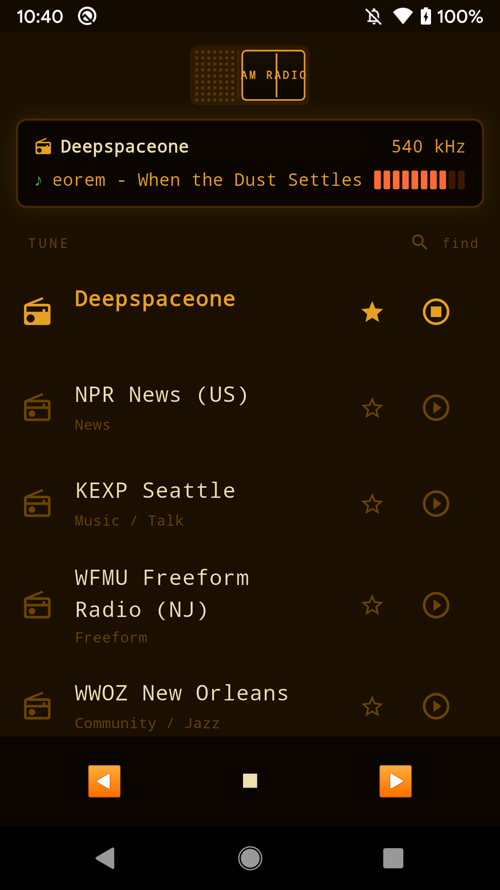

# am_radio

[](https://opensource.org/licenses/BSD-3-Clause)


Disclaimer: AI Agents / AI in general was used heavily to produce this code. Me, the human, hasn't read it all but it runs and works and has bugs that maybe more or less minor and perhaps aesthetic UX stuff only. I have my doubts but the bugs can be prompted away or hand coded away. Use caution and read the code and let me know.

A command-line and mobile internet radio player with vintage AM radio aesthetics.

Requires [`mpv`](https://mpv.io/)

## Example

```
perl am_radio.pl -oi -s5                                     
[!] Lo-Fi AM Radio filter activated.

=== Stream Information ===
  Station: Classical KUSC
  Genre:   Classical
  Bitrate: 128 kbps
==========================


Tuning in to KUSC Classical (Los Angeles)...
Press Ctrl+C to stop playback.


=== Now Playing ===
  Track:   Edward Elgar - Enigma Variations Op 36
==========================
```



use the `-f` flag to discover stations from [https://de1.api.radio-browser.info/json/stations/search](https://de1.api.radio-browser.info/json/stations/search)

## Mobile App

A Flutter mobile app for Android, iOS, and Linux desktop is available in the `mobile/` directory. See [mobile/README.md](mobile/README.md) for full documentation.



### Quick Deploy to Android

Deploy the app to a connected Android device with automatic screenshot capture:

```sh
# From the repo root
./deploy-android.sh

# Or with Nix:
nix run .#deploy-android
```

The script builds the app, installs it on your device, launches it, and captures a screenshot automatically.

## License

This project is licensed under the BSD 3-Clause License - see the [LICENSE](LICENSE) file for details.

### Third-Party Dependencies

This project uses several open-source dependencies:

**Perl CLI (`am_radio.pl`):**
- `mpv` (GPL/LGPL) - Media player, used as external program
- `curl` - For API requests
- `ffprobe` (LGPL) - For stream metadata

**Flutter Mobile App:**
- Flutter SDK (BSD-3-Clause)
- `http` package (BSD-3-Clause)
- `provider` package (MIT)
- `just_audio` package (MIT)
- `shared_preferences` package (BSD-3-Clause)

All dependencies maintain compatible licenses for commercial distribution.
